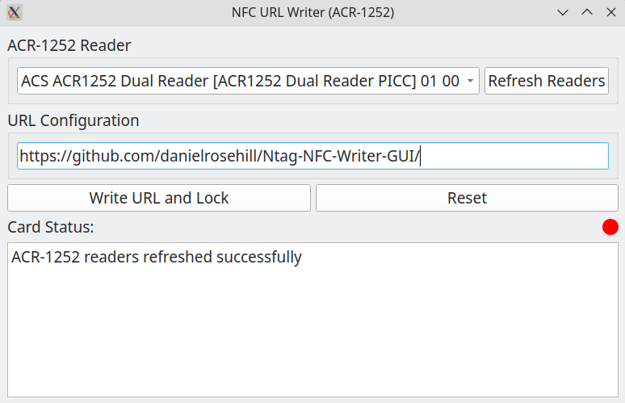
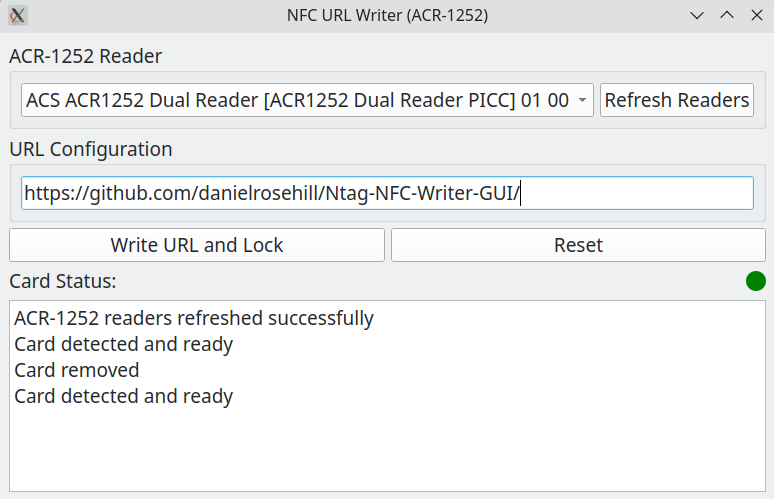
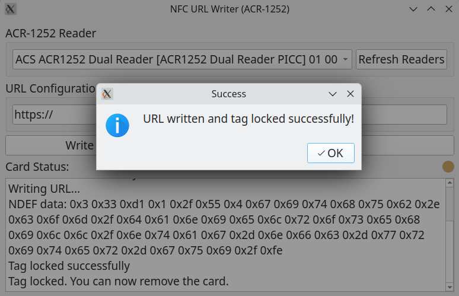
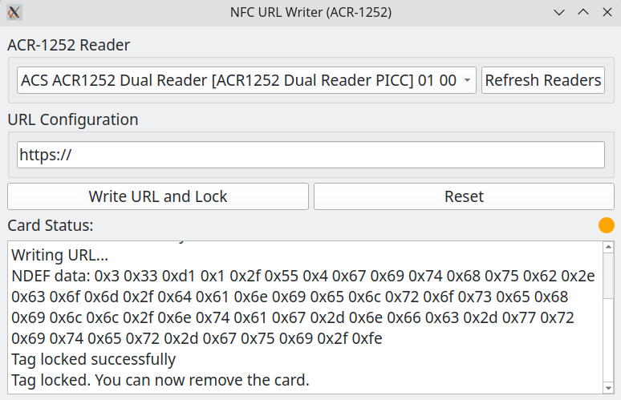

# NFC Writer GUI For NTAG213/215/216 (OpenSUSE Tumbleweed Linux)

This Python GUI was fully generated using Claude Sonnet 3.5. 

It is designed for writing URLs to NTAG213/215/216 type NFC tags (Mifare Ultralight C compatible tags) using the ACR. 1252 USB NFC reader/writer.

These tags are widely available on platforms like Aliexpress, are cheap and affordable and suitable for use (my use-case) for inventory management systems.

I use and recommend the excellent Homebox.

I have been using it on Open SUSE Tumbleweed (KDE Plasma) .

## Screenshots

### V1

After learning that attempting to get compatibility for every type of NFC tag was way more complicated than it looked, I decided to be more modest and focus on the couple of tags I was working with at the NDEF level.

The GUI is intended for those quickly writing lots of these tags for the purpose of an inventory system. It features a convenient tally light to let the user know when the card is ready to be written, and then a safe to remove indicator in the tag has been written and locked.

 
## Author

Daniel Rosehill  
(public at danielrosehill dot com)

## Licensing

This repository is licensed under CC-BY-4.0 (Attribution 4.0 International) 
[License](https://creativecommons.org/licenses/by/4.0/)

### Summary of the License
The Creative Commons Attribution 4.0 International (CC BY 4.0) license allows others to:
- **Share**: Copy and redistribute the material in any medium or format.
- **Adapt**: Remix, transform, and build upon the material for any purpose, even commercially.

The licensor cannot revoke these freedoms as long as you follow the license terms.

#### License Terms
- **Attribution**: You must give appropriate credit, provide a link to the license, and indicate if changes were made. You may do so in any reasonable manner, but not in any way that suggests the licensor endorses you or your use.
- **No additional restrictions**: You may not apply legal terms or technological measures that legally restrict others from doing anything the license permits.

For the full legal code, please visit the [Creative Commons website](https://creativecommons.org/licenses/by/4.0/legalcode).